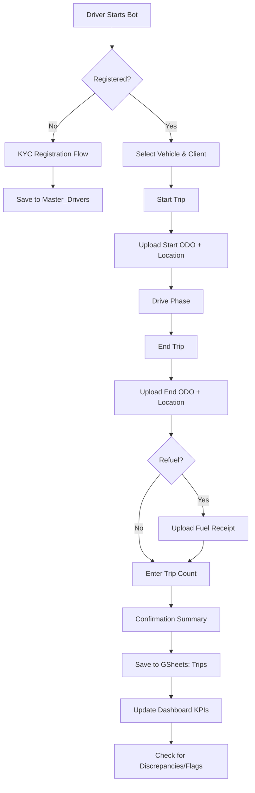

# System Architecture & Workflow

## Workflow Diagram

## Data Architecture

### Google Sheets Schema
*   **Trips**: Transactional log of every duty. Includes `Trips_Count`, `Distance`, `Fuel_Cost`, and image links.
*   **Master_Vehicles**: Fleet registry with last known ODO and status (Idle/On Trip).
*   **Master_Drivers**: Driver KYC data (Phone, License, Name).
*   **Dashboard**: High-level KPI view using `COUNTIFS` and `SUMIFS` formulas.

### Security & Compliance
*   **KYC Storage**: All license photos are stored in a private Google Drive folder indexed by driver name.
*   **Fraud Detection**: The system flags trips where Odometer jumps are >300km or when start/end locations don't match the reported distance.
*   **Role-Based Access**: Drivers interact only via Telegram; managers have edit access to the Sheets backend.
